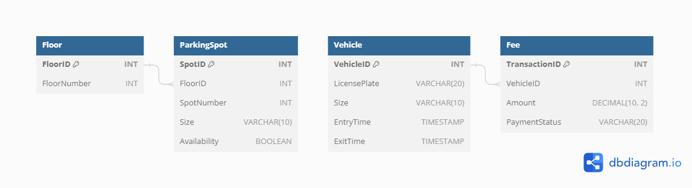

# Database Model:

# 1. Floor Table:

- FloorID (Primary Key)
- FloorNumber

  ```sql
  CREATE TABLE Floor (
  FloorID INT PRIMARY KEY,
  FloorNumber INT
  );
  ```

# 2. ParkingSpot Table:

- SpotID (Primary Key)
- FloorID (Foreign Key referencing Floor table)
- SpotNumber
- Size (Small, Medium, Large)
- Availability (Boolean)

```sql
CREATE TABLE ParkingSpot (
  SpotID INT PRIMARY KEY,
  FloorID INT,
  SpotNumber INT,
  Size VARCHAR(10),
  Availability BOOLEAN,
  FOREIGN KEY (FloorID) REFERENCES Floor(FloorID)
)
```

# 3. Vehicle Table:

- VehicleID (Primary Key)
- LicensePlate
- Size (Small, Medium, Large)
- EntryTime
- ExitTime

```sql
  CREATE TABLE Vehicle (
    VehicleID INT PRIMARY KEY,
    LicensePlate VARCHAR(20),
    Size VARCHAR(10),
    EntryTime TIMESTAMP,
    ExitTime TIMESTAMP
);
```

# 4. Fee Table:

- TransactionID (Primary Key)
- VehicleID (Foreign Key referencing Vehicle table)
- Amount
- PaymentStatus (Pending, Paid)



# Algorithm for Spot Allocation:

- Initialization:
  Maintain a list of available parking spots on each floor.
  Categorize parking spots by size (small, medium, large).

- Vehicle Entry:
  When a vehicle enters the parking lot, determine its size.
  Select an available parking spot of the appropriate size.
  If there are multiple available spots of the required size, choose the one closest to the entrance to optimize space utilization.

- Algorithm Steps:
  Iterate through the list of available spots on the specified floor.
  Filter spots based on the vehicle size.
  Implement a strategy to select the best spot.

- Update Availability:
  Once a spot is selected, mark it as occupied.
  Update the ParkingSpot table to reflect the new availability status.

# pseudocode for steps above

```typescript

interface ParkingSpot {
  SpotID: number;
  FloorID: number;
  Size: string;
  Availability: boolean;
}

// Simulated database functions
function getAvailableSpots(floorID: number, vehicleSize: string): ParkingSpot[] {
  // Simulated database query
  const spots: ParkingSpot[] = /* Perform database query */;
  return spots.filter(spot => spot.FloorID === floorID && spot.Size === vehicleSize && spot.Availability);
}

function markSpotAsOccupied(spot: ParkingSpot): void {
  // Simulated update in memory
  spot.Availability = false;
}

function updateSpotAvailabilityInDatabase(spot: ParkingSpot): void {
  // Simulated database update
  /* Perform database update */
}

function assignParkingSpot(vehicleSize: string, floorID: number): string {
  const availableSpots = getAvailableSpots(floorID, vehicleSize);

  if (availableSpots.length === 0) {
    return "No available parking spots of the required size.";
  }

  const selectedSpot = selectBestSpot(availableSpots);

  markSpotAsOccupied(selectedSpot);
  updateSpotAvailabilityInDatabase(selectedSpot);

  return "Parking spot assigned successfully.";
}

function selectBestSpot(availableSpots: ParkingSpot[]): ParkingSpot {
  // Example: Choose the first available spot for simplicity
  return availableSpots[0];
}

// Example usage
const result = assignParkingSpot("Medium", 1);
console.log(result);

```

# Parking Fee Calculation

This simple pseudocode provides a basic logic for calculating parking fees based on time, with the option to apply special rates for holiday time.

Use the `calculateParkingFee` function to calculate parking fees. It accepts three parameters:

- `entryTime` (Date): The time when the vehicle entered the parking lot.
- `exitTime` (Date): The time when the vehicle exited the parking lot.
- `isSpecialDay` (boolean): Indicates whether the parking period includes a holiday.

The function returns the total parking fee (number).

```typescript
function calculateParkingFee(
  entryTime: Date,
  exitTime: Date,
  isSpecialDay: boolean
): number {
  const timeInMinutes = calculateTimeDifferenceInMinutes(entryTime, exitTime);

  // Define regular rates (per minute, adjust as needed)
  const regularRate = 1; // Example: 1 rupee per minute

  // Apply special holiday rate if applicable
  const holidayRateMultiplier = isSpecialDay ? 1.5 : 1; // Example: 1.5x for holidays

  // Calculate the total fee
  const totalFee = timeInMinutes * regularRate * holidayRateMultiplier;

  return totalFee;
}

function calculateTimeDifferenceInMinutes(
  entryTime: Date,
  exitTime: Date
): number {
  const timeDifferenceInMillis = exitTime.getTime() - entryTime.getTime();
  return Math.ceil(timeDifferenceInMillis / (1000 * 60)); // Convert milliseconds to minutes and round up
}
```

# Concurrency Handling:

- Transaction Management:
  Implement transactional mechanisms in database to ensure ACID properties are followed.

- Queue Management:
  Use queues to kafka or rabbit mq for managing incoming requests and distribute them efficiently.

- Load Balancing:
  Implement load balancing mechanisms to distribute incoming requests evenly across the system.

- Caching Mechanisms:
  Implement caching strategies to store frequently accessed data and reduce the load on the database.
